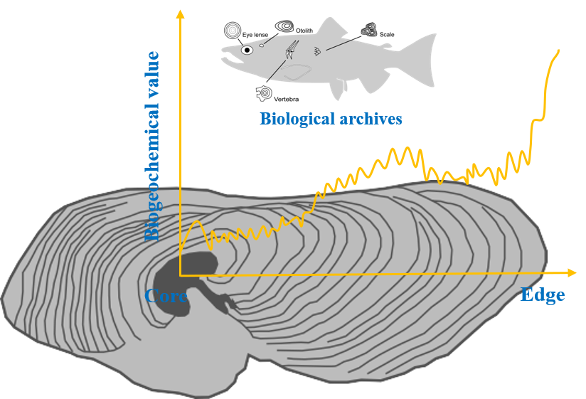

### ***MFishBT: A global database of biogeochemical tags in migratory fish***

In this datapaper we will collect all the available data on trace element or stable isotope from fish biomineral structures core–edge transects with fields information (e.g., fished [unique identifier for each fish], oto_Sr_Ca [otolith bulk element], distance [distance from otolith core to edge (um)], …). We have built a framework for updating and including increasingly biogeochemical studies in migratory fish over time. The MFishBT (Migratory Fish’s Biogeochemical Tags) database can serve a variety of needs in scientific research, conservation, and management of migratory fish, such as mapping multi-element chemoscapes/isoscapes, reconstruction of migratory fish routes, and future comparison in biologging and biotelemetry approaches and beyond. Additionally, the MFishBT database will be updated periodically and provides access to comprehensive published information to inform the conservation and management of migratory fishes. We have great interest on both published and unpublished data. If you want to join us and become a coauthor on a ECOLOGY paper, write to us:

Liuyong Ding [ly_ding@126.com], Chengzhi Ding [chzhding@ynu.edu.cn]

##Data collection will start on April 2022, and the submission is scheduled to June 2023


<!-- README.md is generated from README.Rmd. Please edit that file -->
# MFishBTdat 

## Description

The `MFishBTdat` package contains a large collection of biomineral archives datasets of migratory fish. These datasets have important applications to biogeochemistry and ecosystem science. The development of this package is inspired by [**metadat**](https://github.com/wviechtb/metadat).

## Installation

The development version of the package can be installed with:

```r
install.packages("remotes")
remotes::install_github("Otoliths/MFishBTdat")
```

This builds the package from source based on the current version on [GitHub](https://github.com/Otoliths/MFishBTdat).

## Browsing and Searching for Datasets

A listing of all datasets in the package can be obtained with `help(package = MFishBTdat)`. Each dataset is also tagged with one or multiple concept terms. These concept terms refer to various aspects of a dataset, such as the biogeochemical tags, the biomineral archives/structures, the microchemical/isotopic elements, and the FAO major fishing areas that can be illustrated with the dataset. The [`dat_search()`](https://Otoliths.github.io/MFishBTdat/reference/dat_search.html) function can be used to search among the existing datasets in the package based on their concept terms or based on a full-text search of their corresponding help files.

You can also read the documentation online at [https://Otoliths.github.io/MFishBTdat/](https://Otoliths.github.io/MFishBTdat/) (where the output from the example analyses corresponding to each dataset is provided).

## Contributing New Datasets

We welcome contributions of new datasets to the package. For each dataset, there must be a citable reference, ideally in a peer-reviewed journal or publication. The general workflow for contributing a new dataset is as follows:

- Install the `MFishBTdat` package in R in the usual manner (i.e., `install_github("Otoliths/MFishBTdat")`).
- If you are familiar with Git/GitHub and making pull requests, fork the [package repository](https://github.com/Otoliths/MFishBTdat). Otherwise, [download](https://github.com/Otoliths/MFishBTdat/archive/master.zip) the source version of the package from GitHub and unzip the file to some directory on your computer.
- Place the raw data (in a non-binary format) in the `data-raw` directory. The file should be named `bt.<author>.<year>.<ext>`, where `<author>` is the last name of the first author of the publication from which the data come, `<year>` is the publication year, and `<ext>` is the file extension (e.g., `.txt`, `.csv`).
- Place a corresponding R script in the `data-raw` directory named `bt.<author>.<year>.r` that reads in the data, possibly does some data cleaning/processing, and then saves the dataset to the `data` directory (using `save()`), with name `bt.<author>.<year>.rda`.
- Start R, load the `MFishBTdat` package (i.e., `library(MFishBTdat)`), and then run the `dat_prepare()` function (either set the working directory to the location of the source package beforehand or use the `pkgdir` argument of the `dat_prepare()` function to specify the source package location).
- For a new dataset, this should create a boilerplate template for a corresponding help file in the `man` directory, named `bt.<author>.<year>.Rd`. Edit the help file, adding the title and a short description of the dataset in general, a description of each variable in the dataset, further details on the dataset (e.g., the field of research, how the data was collected, the purpose of the dataset or what it was used for, the effect size or outcome measure used in the analysis, the types of analyses/models that can be illustrated with the dataset), a reference for the source of the dataset, one or multiple concept terms, the name and email address of the contributor of the dataset, and (optionally) example code to illustrate the analysis of the dataset.
- Either make a pull request (if you are familiar with this workflow) or zip up the `bt.<author>.<year>.<ext>`, `bt.<author>.<year>.r`, `bt.<author>.<year>.rda`, and `bt.<author>.<year>.Rd` files and open up a new [issue at GitHub](https://github.com/Otoliths/MFishBTdat/issues), attaching the zip file.
- If the above makes no sense to you, you can also open an issue or email one of the package authors and attach a zip file including a cleaned, raw data file in `.txt` or `.csv` format, along with a meta-data file (format doesn't matter) that includes the information described above.

## Citing the Package

If you use these data, please cite both the `MFishBTdat` package (see `citation("MFishBTdat")` for the reference) and the original source of the data as given under the help file of a dataset.

## Bug/Error Reports

If you think you have found an error in an existing dataset or a bug in the package in general, please go to https://github.com/Otoliths/MFishBTdat/issues and open up a new issue.

## :heart: Thank you for the generosity of sharing raw data

- [**Shuai Zhang**](https://www.researchgate.net/profile/Shuai-Zhang-24) `South China Sea Fisheries Research Institute, Chinese Academy of Fishery Sciences, China`
